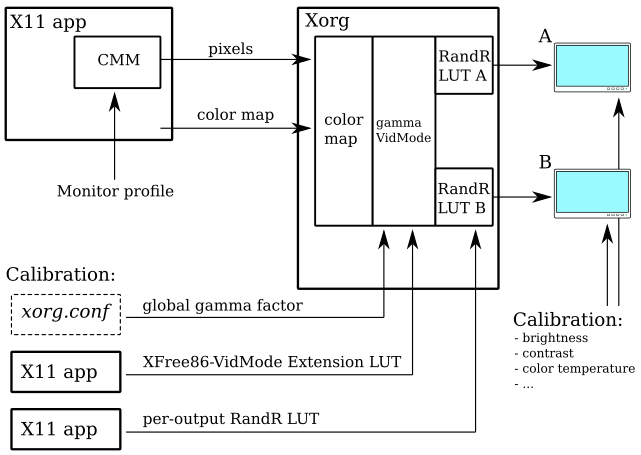
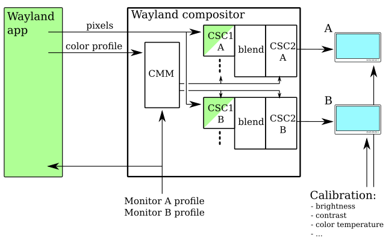

.. Copyright 2020 Collabora, Ltd.

.. contents::

Wayland Color Management and HDR Design Goals
=============================================

The goals of Wayland color management and *high dynamic range* (HDR) support
protocol extension are:

- Reliably maintain the display server color setup.
- Support professional color managed applications (presentation).
- Support displaying TV broadcasts and other high quality video content.
- Support a wide variety of monitors and application content,
  including wide gamut and/or HDR.
- Bring basic color management to applications that are not color-aware at all.
- Bring adequate color management to Wayland applications that are color-aware
  but not color managed.

Once a display system has been calibrated, measured and configured, it should
keep its settings until the user intentionally changes them. Achieving this
reliability requires protecting the system from accidental changes and avoiding
dependency on hardware default state as much as possible. The former comes from
not allowing arbitrary programs to change the settings. The latter is realized
by very careful Wayland compositor implementation that takes into account the
details of the underlying system API. For example, with DRM also unrecognized
KMS properties need to be saved and restored.

It should be reasonably possible to run existing color managed applications,
particularly X11 applications through Xwayland, unmodified and get at least the
level of color managed presentation features they received on Xorg. It is
possible that this requires e.g. re-creating monitor color profiles,
recalibration, or other reconfiguring.

The use of ``xrandr`` and similar X11 tools and interfaces are intentionally
not supported as the Wayland desktop paradigm does not allow clients to force
effects on other clients. That kind of global properties, including video mode
and display color depth, are left for each Wayland compositor's own settings
management as they are end user preferences.

The protocol extension should be usable for professional broadcast display
usage, meaning that it is suitable for use inside a television for all of
aerial, cable, and internet delivered content. However, the extension might not
be completely sufficient, particlarly where it would violate the Wayland
desktop paradigm (e.g. requests to change display video mode or calibration
shall not be included).

The support for wide variety of monitors is achieved by communicating suffient
information about the monitors to applications, so that applications can adapt
to the monitors if they choose to do so. The proper composition and handling of
a wide variety of application content is achieved by applications describing
the content in sufficient detail for a Wayland compositor to process it
correctly.

Applications that pay no mind whatsoever to color management are called
*color-unaware*. They have been written for an average system that more or less
resembles (or not) sRGB in its color output. This is the large majority of all
applications on X11 and Wayland. On a usual consumer monitor they look pretty
much ok, but on a color managed monitor with special features (wide gamut, HDR)
they might be an eye sore when displayed side by side with properly color
managed applications. A goal for Wayland color management is to make these
application look "pretty much ok" on such special monitors without
modifications to the applications or toolkits, while letting color managed
applications look their best simultaneously.

One step forward from color-unaware applications are *color-aware* applications
that also are not fully color managed applications. These applications are
fixed to one or few well-known color spaces, the traditional sRGB for instance.
They don't try to adapt to the monitor and they might not use any *color
management module* (CMM). These applications can still describe their content's
color space to a Wayland compositor, which will then take care of color managed
presentation of the content.

The above goals imply that a Wayland compositor is an active participant in
color management, converting all application content into some common color
space for display on a monitor. As a compositor can do that separately for each
monitor, it is possible to present the same window adequately color managed on
multiple monitors simultaneously. It is also possible to keep a monitor in HDR
mode while showing both *standard dynamic range* (SDR) (traditional or
unmodified applications) and HDR content simultaneously. A practical use case
for that is a video player showing a HDR video on one Wayland surface and SDR
subtitles and user interface on another surface.

Color Pipeline Overview
=======================

As the reader may be well familiar with how color management works in a
X11 graphics stack, it is useful to review that before introducing the
Wayland color management architecture, and then compare the two. The
architecture design between X11 and Wayland color management is
fundamentally different. They also differ in what is considered as
calibration.

Calibration in this document is taken to mean all those settings and parameters
affecting the reproduction of colors on a monitor the user has to take care of
manually. Obviously this includes things like monitor adjustments you make with
the setup menu or buttons on a monitor itself. Other things may also need to be
taken care of manually and that is where the X11 and Wayland software
architectures differ.

This overview does not consider creating or measuring color profiles.
That is a topic to be discussed in another chapter. Here it is assumed
that appropriate monitor color profiles are already available.

The output color space here refers to the color space and OETF used for the
final framebuffer content, or more precisely, the electrical (digital) signal
to be transmitted through the wire to a monitor. The monitor imposes its own
EOTF when convering the signal into actual light.

X11 color pipeline
------------------

The X11 color pipeline is shown in `Figure 1`_. In this model, the
display server is completely agnostic of any color management happening.
The display server's job is to stay out of the way while X11 clients do
all their color reproduction on their own, perhaps with the help of a CMM.

.. _Figure 1:

   Figure 1.
   X11 color pipeline. Color management happens primarily in the
   clients. All display server color settings are considered to be
   included in calibration.

This model views the display server as part of the display, something that
passively shows your images as is. Therefore all the display server settings
that affect color (gamma settings, color *look-up tables* (LUT)) are considered
to be part of the display calibration. A monitor ICC profile file may contain a
VCGT_ tag with the LUT values that something needs to load into one of the LUTs
of the display server. The monitor color profile recorded in an ICC file is not
valid if the VCGT tag is not applied as intended.

Keeping a monitor color profile valid depends on keeping the calibration fixed.
With X11 this is quite fragile, because all X11 clients are allowed to change
any color settings in the display server at any time, without notice and
without user interaction. It is mostly up to the user to avoid running programs
that touch those settings, except the one program that sets up the correct
calibration. Old games often play with gamma settings, and some applications
are specifically built to change colors like Redshift_.

Not only are all X11 clients able to change your color settings behind
your back, but there are actually several different settings for more or
less the same thing. You can set a global gamma factor in your
``xorg.conf``. XFree86-VidModeExtension_ allows to control gamma ramps
via parameters and as LUTs. RandR_ extension added per-output LUTs.
Before `Xorg 1.19`_ more or less the setting set last overwrote all the
others, but starting from 1.19 all these settings are combined to
produce the final LUT (commit_). There is also a proposal to add even more
tunables (MR352_). It may also be possible to change the monitor behavior
through RandR_.

`Figure 1`_ depicts an X11 server with only one ``Screen`` in the protocol but
two independent outputs (monitors). If applications need to use a different
monitor profile for each output, they have to watch their window position,
detect which output it is on, and repaint their window with the right profile.
The advantage of this is that the application knows exactly (if it is smart
enough to detect it) which parts of the window show on which output. If the
two monitors were setup as clones then the application is forced to pick just
one monitor profile.

.. _Redshift: http://jonls.dk/redshift/
.. _RandR: https://gitlab.freedesktop.org/xorg/proto/xorgproto/-/blob/master/randrproto.txt
.. _XFree86-VidModeExtension: https://cgit.freedesktop.org/xcb/proto/tree/src/xf86vidmode.xml
.. _Xorg 1.19: https://lists.x.org/archives/xorg-announce/2016-November/002737.html
.. _commit: https://gitlab.freedesktop.org/xorg/xserver/-/commit/b4e46c0444bb09f4af59d9d13acc939a0fbbc6d6
.. _MR352: https://gitlab.freedesktop.org/xorg/xserver/-/merge_requests/352

Wayland color pipeline
----------------------

The fundamental difference in the Wayland color pipeline (`Figure 2`_) compared
to the X11 color pipeline (`Figure 1`_) is that the display server is an active
participant in color management. The display server (a Wayland compositor)
automatically converts from a client provided color space to an output color
space as necessary. The compositor is the primary user of a CMM, although
clients can use a CMM to prepare their content as well.

A Wayland client (application) tells the compositor what color space its
content is in. Knowing also the monitor color profile, the compositor (with the
help of a CMM) can do the necessary color conversion separately for each
monitor. Even when monitors are cloned, each monitor can have its own arbitrary
color profile. A client does not necessarily need to react at all when its
window is moved from one monitor to another to maintain good color
reproduction.

`Figure 2`_ roughly depicts how this works. A compositor uses a CMM to compute
the necessary color space transformations based on the client provided content
description and the monitor profile.  CSC1 is the color space conversion from
client content color space to the blending space, and CSC2 is the conversion
from blending space to output space for the particular monitor. CSC1 may be
different for each application window. CSC2 depends on the chosen blending
space and the monitor color profile.

The compositor blending color space should use a numerical encoding that is
linear in luminance and has a suitably wide gamut, preferably unbounded. One
potential blending space is the output color space with OETF removed. The
blending space can be different for each monitor. What it actually is, is a
compositor implementation detail.

A client has the possibility to deliver content already in the output color
space. In that case, assuming the pixels from the client are unoccluded and not
blended with anything else, the color space conversion applied by the
compositor on that particular output is identity, up to computation and monitor
wire format precision. This feature can also be used creatively by an
application claiming to deliver content in the output color space but instead
use a different profile internally in preparing its image content.

.. _Figure 2:

   Figure 2.
   Wayland color pipeline. Color management is primarily the
   compositor's responsibility while the clients merely describe their
   content's color properties.

Wayland and Calibration
-----------------------

Calibration in the Wayland model considers only the monitor settings. Video
card properties, including "the LUT", are controlled by the compositor itself
and they are never exposed for clients to set directly. Therefore video card
properties do not need to be considered as calibration. Instead, video card
properties can be used by the compositor to off-load color space conversions to
the hardware as it sees fit and at any time. Modern video cards have more
flexibility (de-gamma LUT, color transform matrix, gamma LUT; sometimes some of
these are found on hardware planes before and/or after plane blending) than
just one LUT, and making the most of them is really only possible if it is done
by the compositor automatically, frame by frame.

If a color profile is given as an ICC file with a VCGT_ tag set, the color
profile contained in that file is not valid unless the LUT encoded in the VCGT
tag is applied (why else would the profile contain the tag?). Hence, also
Wayland compositors need to apply the VCGT tag if it exists, but in this case
it is merely yet another transformation in the abstract color pipeline rather
than something to be loaded directly into hardware.

A compositor may also be able to change the monitor behaviour. AVI infoframes
may be able to change what color space the monitor is expecting data in, for
instance. This still counts as calibration, as the change would invalidate a
color profile measured with another monitor setting. More traditional knobs
(brightness or backlight, contrast, etc.) may be software controllable as well.
The intention is that the compositor has exclusive access to these knobs and is
able to maintain and enforce calibration.

Since the compositor in use is intended to have exclusive access to all
software-controllable calibration settings, there is no risk that applications
would be able to corrupt the calibration. For use cases where calibration is
enough and a (custom) monitor color profile is not necessary, the compositor
can switch the calibration on-demand. For example, when showing video content
in fullscreen, a compositor may tell the monitor or TV to switch to a better
suited color mode. It is up for compositor policy and user preferences to
determine when that is appropriate.

For general information on calibration versus profiling, see `Elle Stone`_.

.. _VCGT: http://www.argyllcms.com/doc/calvschar.html
.. _`Elle Stone`: https://ninedegreesbelow.com/photography/monitor-profile-calibrate-confuse.html

Well-Known EOTFs, chromaticities and whitepoints
================================================

EOTF: An EOTF is the conversion from non-linear electronic representation to
the linear display light.

For more information, refer to the spec `Transfer functions`_.

+--------------+---------------------------------------------------------------+
| EOTF         | Description                                                   |
+--------------+---------------------------------------------------------------+
| unknown      | Unknown EOTF                                                  |
+--------------+---------------------------------------------------------------+
| linear       | Linear transfer function                                      |
+--------------+---------------------------------------------------------------+
| srgb         | sRGB(standard Red Green Blue) transfer function               |
+--------------+---------------------------------------------------------------+
| bt2087       | BT.2087 transfer function                                     |
+--------------+---------------------------------------------------------------+
| adobergb     | Adobe RGB transfer function                                   |
+--------------+---------------------------------------------------------------+

Chromaticity: Chromaticity is an objective specification of the quality of a
color regardless of its luminance.

Chromaticities in the CIE 1931 system are always expressed in xyY with Y
omitted.

For more information, refer to the spec CIE 1931 color space.

+--------------+--------------------------+-----------------------------------+
| Chromaticity | RGB primaries (x, y)     | Description                       |
+--------------+--------------------------+-----------------------------------+
| unknown      |                          | Unknown chromaticity              |
+--------------+--------------------------+-----------------------------------+
|              | R x = 0.630, y = 0.340   |                                   |
|              +--------------------------+                                   |
| bt601        | G x = 0.310, y = 0.595   | `ITU-R BT.601`_                   |
| (525-line)   +--------------------------+                                   |
|              | B x = 0.155, y = 0.070   |                                   |
+--------------+--------------------------+-----------------------------------+
|              | R x = 0.640, y = 0.330   |                                   |
|              +--------------------------+                                   |
| bt601        | G x = 0.290, y = 0.600   | `ITU-R BT.601`_                   |
| (625-line)   +--------------------------+                                   |
|              | B x = 0.150, y = 0.060   |                                   |
+--------------+--------------------------+-----------------------------------+
|              | R x = 0.630, y = 0.340   |                                   |
|              +--------------------------+                                   |
| smpte170m    | G x = 0.310, y = 0.595   | `SMPTE 170M-1999`_                |
|              +--------------------------+                                   |
|              | B x = 0.155, y = 0.070   |                                   |
+--------------+--------------------------+-----------------------------------+
|              | R x = 0.640, y = 0.330   |                                   |
|              +--------------------------+                                   |
| bt709        | G x = 0.300, y = 0.600   | `ITU-R BT.709`_                   |
|              +--------------------------+                                   |
|              | B x = 0.150, y = 0.060   |                                   |
+--------------+--------------------------+-----------------------------------+
|              | R x = 0.708, y = 0.292   |                                   |
|              +--------------------------+                                   |
| bt2020       | G x = 0.170, y = 0.797   | `ITU-R BT.2020`_                  |
|              +--------------------------+                                   |
|              | B x = 0.131, y = 0.046   |                                   |
+--------------+--------------------------+-----------------------------------+
|              | R x = 0.640, y = 0.330   |                                   |
|              +--------------------------+                                   |
| srgb         | G x = 0.300, y = 0.600   | `IEC/4WD 61966-2-1: default       |
| (unverified) +--------------------------+ RGB colour space - sRGB`_         |
|              | B x = 0.150, y = 0.060   |                                   |
+--------------+--------------------------+-----------------------------------+
|              | R x = 0.6800, y = 0.3200 |                                   |
|              +--------------------------+                                   |
| displayp3    | G x = 0.2650, y = 0.6900 | `Display P3`_                     |
|              +--------------------------+                                   |
|              | B x = 0.1500, y = 0.0600 |                                   |
+--------------+--------------------------+-----------------------------------+
|              | R x = 0.6400, y = 0.3300 |                                   |
|              +--------------------------+                                   |
| adobergb     | G x = 0.2100, y = 0.7100 | `Adobe RGB`_                      |
|              +--------------------------+                                   |
|              | B x = 0.1500, y = 0.0600 |                                   |
+--------------+--------------------------+-----------------------------------+

Whitepoint: A white point is a set of chromaticity coordinates to define the color white.

+--------------+--------------------------+-----------------------------------+---------------------------------------+
| White point  | Chromaticity coordinates | Description                       | Documentation source                  |
|              | (x, y)                   |                                   |                                       |
+--------------+--------------------------+-----------------------------------+---------------------------------------+
| unknown      |                          | Unknown whitepoint                |                                       |
+--------------+--------------------------+-----------------------------------+---------------------------------------+
| dci          | x = 0.3140, y = 0.3510   | DCI standard for digital cinema   | `SMPTE-EG-0432-1:2010`_ Digital Source|
| (unverified) |                          | motion pictures                   | Processing                            |
+--------------+--------------------------+-----------------------------------+---------------------------------------+
| d50          | x = 0.3457, y = 0.3585   | D50 standard for graphic arts     | `ISO/CIE DIS 11664-2`_ Colorimetry —  |
| (unverified) |                          | industry                          | Part 2: CIE standard illuminants      |
+--------------+--------------------------+-----------------------------------+---------------------------------------+
| d65          | x = 0.3127, y = 0.3290   | D65 standard for video displays   | `ISO/CIE DIS 11664-2`_ Colorimetry —  |
| (unverified) |                          |                                   | Part 2: CIE standard illuminants      |
+--------------+--------------------------+-----------------------------------+---------------------------------------+

.. _`Transfer functions`: https://www.khronos.org/registry/DataFormat/specs/1.3/dataformat.1.3.html#TRANSFER_CONVERSION
.. _`ITU-R BT.601`: http://www.itu.int/rec/R-REC-BT.601/en
.. _`SMPTE 170M-1999`: https://www.itu.int/rec/R-REC-BT.1700/en
.. _`ITU-R BT.709`: https://www.itu.int/rec/R-REC-BT.709/en
.. _`ITU-R BT.2020`: http://www.itu.int/rec/R-REC-BT.2020/en
.. _`IEC/4WD 61966-2-1: default RGB colour space - sRGB`: https://webstore.iec.ch/publication/6169
.. _`Display P3`: https://developer.apple.com/reference/coregraphics/cgcolorspace/1408916-displayp3
.. _`Adobe RGB`: https://www.adobe.com/digitalimag/pdfs/AdobeRGB1998.pdf
.. _`SMPTE-EG-0432-1:2010`: http://www.color.org/chardata/rgb/DCIP3.xalter
.. _`ISO/CIE DIS 11664-2`: https://www.iso.org/standard/77215.html

High Dynamic Range
==================

At the simplest level, High Dynamic Range (HDR) refers to a luminance range
larger than traditional. Many also associate wide color gamut to HDR, but that
has been defined with traditional color management already. The traditional
dynamic range is referred to as Standard Dynamic Range (SDR). HDR implies
brighter whites which allows highlights to be brighter and bright image areas
to contain more details than SDR. HDR may also imply deeper blacks, improving
details in the dark end of the luminance axis as well, because traditionally
"black" still has non-zero luminance. To deliver all the additional details and
avoid losing details in the SDR range, HDR imagery needs more bits per pixel
than traditional content.

This protocol extension aims to integrate HDR with color management in a way
that both are possible to achieve simultaneously when clients so choose. While
color management and ICC profiles are concerned of relative luminance or code
values on each color channel, the HDR part of the extension extends the
luminance range beyond SDR. Wayland clients are able to do their own color
management and tone mapping for HDR the same way they do color management for
SDR: prepare content to match the output properties, which will let it go
through the compositor practically unaltered. With SDR color management they
use the output color space, and with HDR color management they use also the
output dynamic range.

The output and content dynamic range is expressed as an extended dynamic range
value. When content dynamic range differs from that of an output, the Wayland
compositor in a system is expected to compensate by applying a suitable tone
mapping.

Extended Dynamic Range for Relative Luminance
---------------------------------------------

In this extension the dynamic range (or luminance range) is communicated as
Extended Dynamic Range (EDR) value. The `definition of EDR`_ as used here comes
from Apple but with consideration to luminance of black. EDR value is the
luminance ratio of the HDR maximum white and the SDR maximum white using the
black level (which may be higher than 0 cd/m²) as the origin. Therefore, EDR
value 1.0 means purely SDR as there is no difference between SDR and HDR
maximum white luminances. EDR value 4.0 means the full (HDR) range is four
times the SDR range. In other words,

::

        HDR maximum white - black
  EDR = ------------------------- .
        SDR maximum white - black

Not all monitors present SDR content with the same luminance. There are
standards that use the values of 80 or 200 cd/m² as the SDR maximum white
luminance, but varying viewing conditions and user preferences may call for any
value. Therefore the absolute luminance for the SDR maximum white is not a fixed
quantity. Monitors do have some absolute maximum luminance they can reach, so
how much dynamic range there is left for HDR may well depend on the monitor's
"normal" (SDR) brightness, or in other words the user's preferred nominal
brightness.

An output's EDR value depends on several things: the monitor capabilities (the
minimum luminance, the maximum HDR luminance), the monitor settings (adjustment
knobs), and user preference for the SDR maximum white level which is affected
by the viewing environment. Therefore Wayland compositors should allow users to
configure an output's EDR value. This could be in the form of setting the
relative SDR maximum white level as a percentage of the video signal, the
absolute luminance of the SDR maximum white in cd/m² if you can trust EDID on
the maximum luminance, or the output's EDR value as is.

A default EDR value for a HDR video mode output may be possible to approximate
from EDID denoted maximum luminance if the compositor wants to default to one
cd/m² number for the SDR maximum white, but that assumes certain viewing
conditions, e.g. average office environment. Using a percentage of the video
signal range for the default EDR value is not recommended because of monitors
differing wildly in their maximum luminance, assuming the video signal encodes
relative and not absolute luminance. Quantization effects or artifacts due to
framebuffer pixel format and the pixel bit depth in the video signal may also
factor in. With low bit depth it might be better to settle for brighter overall
image from smaller EDR value than to risk losing details in the SDR range. For
an SDR video mode, the default EDR value is 1.0.

`Figure 3`_ shows three EDR values and their relative SDR and HDR maximum white
luminance levels as well as the black level. EDR value represents the ratio
between HDR and SDR compared to black, not the overall image brightness as can
be seen in case c) whose EDR value is smaller than for the other less bright
examples. This reflects the intent of HDR: brighter and more detailed
highlights rather than brighter image.

.. _Figure 3:

.. figure:: images/monitor-edr.svg.png
   :alt: EDR value diagram

   Figure 3.
   Three different monitor or content luminance characteristics.
   The ratio of black to HDR maximum white luminance and black to SDR maximum
   white luminance determines the EDR value. The black level may be greater
   than 0 cd/m² and may differ.

Content provided by Wayland clients have their own EDR values per
``wl_surface``. Content EDR value is calculated similarly to output EDR value.
Content HDR maximum white luminance, content SDR maximum white luminance, and
content black luminance as all chosen by the content creator. If content is
encoded with relative luminance, calculating the EDR value does not require
mapping to absolute luminance.

If content is encoded with display-referred absolute luminance, the Wayland
client needs to know the content (encoding) HDR maximum white luminance, the
(movie) SDR maximum white luminance and the black luminance that fit the
artistic intention of the content creator to calculate the appropriate EDR
value. Note, that if the content SDR maximum white luminance changes during a
movie to follow the scene average brightness, changing the content EDR value to
match has the opposite effect: bright scenes get toned down and dark scenes get
toned up while the SDR maximum white level stays the same on display. Therefore
for content encoded in absolute luminance, the SDR maximum white luminance is
merely an arbitrary scaling factor that the client needs to choose.

The use of EDR value to describe content dynamic range means that content
encoded with absolute luminance cannot be presented with absolute luminance
(nit-for-nit). This is intentional to avoid assuming a standard viewing
environment which is usually relatively dark and therefore could lead to a too
dark image for the actual viewing environment.

.. _`definition of EDR`: https://developer.apple.com/documentation/metal/drawable_objects/displaying_hdr_content_in_a_metal_layer/performing_your_own_tone_mapping

Absolute Luminance Content
--------------------------

TBD

EOTFs that define their output in absolute luminance (cd/m²) need something else
than content EDR value. Some specifications propose a "reference white"
absolute luminance, others might not, hence it probably needs to be communicated
explicitly.

EDID can sometimes provide the maximum HDR absolute luminance. Output EDR value
could be used to find the SDR maximum white luminance, but should the content
reference white luminance be mapped to that? Maybe, maybe not.

How to map an absolute luminance range to monitor range?

How to communicate monitor absolute luminance to clients so that they can match
it and avoid tone-mapping in a compositor?

Scene-Referred Luminance
------------------------

TBD

HLG

Glossary
========
API
   application programming interface

AVI
   auxiliary video information (infoframe)

CM
   color management

CMM
   color management module

CRTC
   cathode-ray tube controller, nowadays a hardware block or an abstraction
   that produces a timed stream of raw digital video data

DRM
   direct rendering manager

EOFT
   electro-optical transfer function

HDR
   high dynamic range

KMS
   kernel modesetting, display driver kernel-userspace API

LUT
   look-up table

nit
   cd/m², candelas per square meter, absolute unit of luminance

OETF
   opto-electrical transfer function

SDR
   standard dynamic range

VCGT
   video card gamma table, a non-standard tag added into ICC profiles
   originally by Apple

Wayland
   a window system protocol

X11
   a window system protocol

TODO
====

To allow optimal performance:

- always name the standard color space if one applies
- use the "simplest" ICC profile possible, that is, prefer a parametric
  description over a look-up table; the higher level the description,
  the more ways there are to implement it
- list the supported standard color spaces, so clients can be smarter? optimality?
- if you are a system designer, you can choose the color spaces used such that
  you can always off-load conversion to hardware

Chrome OS cannot afford to do 3D-LUT color conversions. They need to be able to
off-load all color space transformations to the display hardware. Hardware
gamma LUT is a given, CTM possibly, 3D-LUT not. They also cannot use more than
32 bits per pixel for performance reasons.

Chrome OS uses a peculiar EOTF for the blending space: the SDR range uses
so called gamma 2.2 EOTF and the HDR range above it uses a linear function.
This allows them to blend SDR and HDR content without conversions. Therefore it
does blending in essentially non-linear color space, with premultiplied alpha.

New use cases?

- Have two monitors in a mirrored setup, but use different (perceptual) color
  profiles for them, so that on one monitor you see the "real" colors and the
  other monitor shows you image color details you don't normally see due to the
  monitor having a small gamut.

HDR gamut metadata: pixel encoding uses one (standard) color space, but the
actual content gamut used is significantly smaller. A compositor needs to know
the pixel encoding to decode pixels, and it needs to know the gamut for better
`gamut mapping`_.

.. _`gamut mapping`: http://argyllcms.com/doc/iccgamutmapping.html
